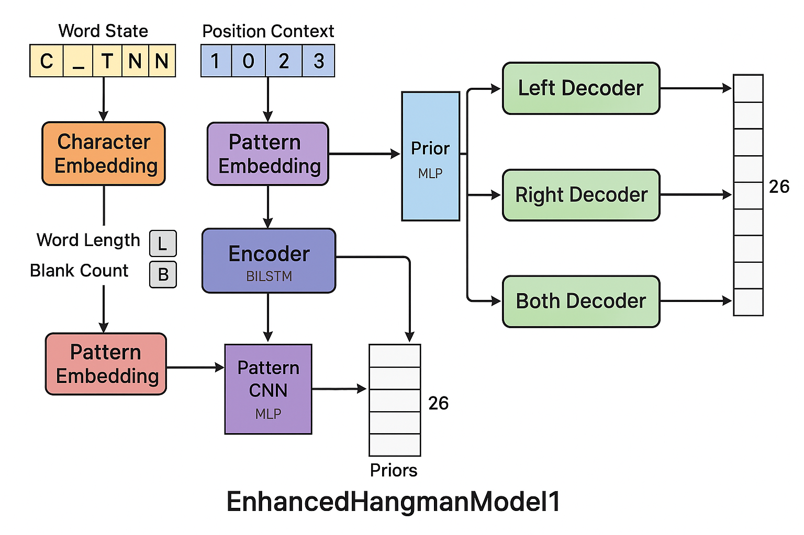

# Enhanced Hangman Solver

This repository features an advanced neural network-based Hangman solver that leverages deep learning, frequency-based heuristics, and dictionary filtering to intelligently guess letters in the classic word game. The architecture is designed for robustness, with curriculum learning, dictionary-based reinforcement, and context-aware decoding.



## Features

- **Deep Contextual Model:** Uses a neural network with character embeddings, CNN pattern extraction, sequence encoding, and context-aware decoders.
- **Curriculum Learning:** Gradually increases difficulty during training by revealing fewer letters as epochs progress.
- **Dictionary-Aware Inference:** Integrates dictionary filtering and frequency-based heuristics for more efficient and accurate guess selection.
- **Hybrid Guessing Strategy:** Combines model predictions with data-driven and frequency-based approaches.
- **Early Stopping & LR Scheduling:** Uses early stopping and learning rate scheduling for stable training.

---

## Architecture Overview

### Architecture Diagram

The following diagram illustrates the core architecture of the `EnhancedHangmanModel1` neural network:


**Description:**  
This diagram shows the data flow from the partially revealed Hangman word (Word State) and position context, through embedding and feature extraction layers, then through a BiLSTM encoder and pattern CNN, with priors calculated by an MLP. The outputs are processed by three context-dependent decoders (Left, Right, Both) to predict the probability distribution over the 26 possible letters for each blank position.

---

### 1. Dataset: `HangmanDataset1`

- **Purpose:** Generates synthetic Hangman game states from a word list, including partial reveals and context annotations.
- **Key Features:**
  - Converts words to lower case and pads/truncates to a fixed length.
  - Randomly reveals a proportion of letters per sample.
  - Annotates each blank position with contextual information (left/right neighbors revealed, proximity to vowels, etc.).
  - Generates targets for the model to predict missing letters in specific positions.
- **Output:** PyTorch tensors for model input and target extraction.

<details>
<summary>Sample Output (from __getitem__)</summary>

- `word_state`: Encoded state of the word (`0` for blank, 1-26 for a-z, 27 for PAD).
- `position_context`: Contextual encoding (neighboring revealed letters).
- `target_positions`/`target_chars`: Indexes and ground-truth letters for missing positions.
- `word_length`, `blank_count`, `next_to_vowel`: Additional features for model input.
</details>

---

### 2. Model: `EnhancedHangmanModel1`

- **Input:** Word state, position context, word length, blank count, and proximity to vowels.
- **Components:**
  - **Character Embedding:** Learns representations for each letter and blank.
  - **Context Embedding:** Encodes local context for each position.
  - **Pattern CNN:** Extracts local patterns in the partially revealed word.
  - **LSTM Encoder:** Bidirectional LSTM encodes the sequence with context.
  - **Position Prior MLP:** Predicts prior probabilities for each position.
  - **Contextual Decoders:** Three decoders for left, right, and both-side context positions.

- **Output:** For each blank position, predicts probabilities for all possible letters (a-z).

---

### 3. Solver: `HangmanSolver1`

- **Purpose:** Provides a high-level interface to play Hangman using the trained model.
- **Features:**
  - Maintains a filtered dictionary based on revealed pattern and wrong guesses.
  - Updates frequency-based multipliers dynamically using dictionary constraints.
  - Selects the best letter to guess using a combination of the neural network and frequency heuristics.
  - Supports hybrid strategies: switches between two solvers based on how much of the word is revealed.

---

## Dictionary & Heuristics

- `build_lengthwise_frequencies`: Builds letter frequency statistics for each word length.
- `get_best_first_guess`: Chooses the optimal first guess for a given word length based on frequencies.
- `word_matches_pattern`: Checks if a word matches the current masked pattern and excludes words with known wrong letters.
- `get_dictionary_filtered_multipliers`: Computes frequency multipliers for candidate letters using dictionary filtering.

---

## Training Procedure

Use the `train_model1` function:

```python
model = train_model1(words, epochs=10, early_stopping_patience=5)
```

- **Curriculum:** The `reveal_ratio` (portion of revealed letters) decreases over epochs, making the task harder as the model improves.
- **Validation:** Early stopping monitors validation loss.
- **Saving:** Best model is saved as `best_model1.pth`.

---

## Simulation

Simulate a game using two solvers (can be the same or different):

```python
result = simulate_hangman_game(solver1, solver2, word, max_wrong=6, verbose=True)
print(result)
```

- Switches strategy based on the proportion of letters revealed.
- Returns win/loss, number of guesses, and final state.

---

## Installation

1. **Clone the repository:**

   ```bash
   git clone https://github.com/BHK4321/hangman.git
   cd hangman
   ```

2. **Install dependencies:**

   ```bash
   pip install torch tqdm
   ```

3. **Prepare your word list:**
   - Place a text file or Python list of valid words in your project.

---

## Usage

1. **Training:**

   ```python
   from your_module import train_model1

   model = train_model1(words, epochs=10)
   ```

2. **Playing or Simulating:**

   ```python
   from your_module import HangmanSolver1, build_lengthwise_frequencies, simulate_hangman_game

   word_list = [...]  # your word list
   length_freq = build_lengthwise_frequencies(word_list)
   solver = HangmanSolver1(word_list, length_freq)

   result = simulate_hangman_game(solver, solver, 'exampleword', max_wrong=6, verbose=True)
   ```

3. **Custom Games:**
   - Integrate the solver into any Hangman interface by calling `predict_letter` with the current state.

---

## License

This project is licensed under the MIT License. See `LICENSE` for details.